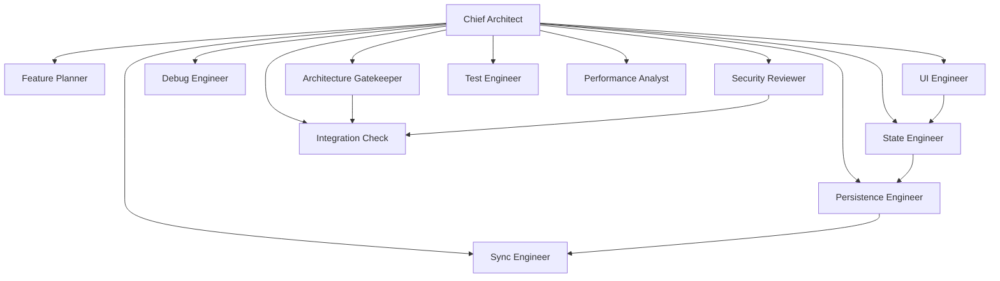

# College Companion AI Engineering Organization

> A permanent skill ecosystem modeling a senior engineering team.

---

## Philosophy

This is not a collection of prompts. It is a software engineering organization — each skill is a dedicated engineer with a single responsibility, clear activation conditions, and explicit boundaries.

**Principles:**
1. **One responsibility per skill.** No overlap. No ambiguity.
2. **Docs are the source of truth.** Skills contain procedures, not data. Project knowledge lives in CLAUDE.md and docs/.
3. **Rejection over repair.** Review skills reject bad implementations. Builder skills do not silently fix errors.
4. **Orchestration first.** A single entry point routes all work. No user should guess which skill to invoke.

---

## Hierarchy

```
                    Chief Architect
                  (orchestrator, entry point)
                         |
            +------------+------------+
            |            |            |
      +----|---+  +----|----+  +------|------+
      | PLAN    |  | BUILD     |  | REVIEW      |
      |         |  |           |  |             |
   feature-  ui-  state-  persist-  arch-  sec-   |
   planner   eng   eng     eng    gate   rev   |
                  sync-           test-  perf-   |
                  eng              eng    analyst|
                                    +----------+
                                    |
                               +----|-----+
                               | VERIFY   |
                               |          |
                            integration-  |
                            check          |
                            test-engineer  |
                            perf-analyst   |
```

## Skills Overview

| # | Skill | Role | Responsibility |
|---|---|---|---|
| 1 | [Chief Architect](chief-architect/SKILL.md) | Orchestrator | Entry point, routing, synthesis |
| 2 | [Feature Planner](feature-planner/SKILL.md) | Planning | Requirements -> implementation plan |
| 3 | [UI Engineer](ui-engineer/SKILL.md) | Build + Review | All UI: widgets, screens, layouts, M3 |
| 4 | [State Engineer](state-engineer/SKILL.md) | Build + Review | Riverpod: providers, notifiers, state flow |
| 5 | [Persistence Engineer](persistence-engineer/SKILL.md) | Build + Review | Drift, repositories, migrations |
| 6 | [Sync Engineer](sync-engineer/SKILL.md) | Build + Review | Offline sync, queue, conflict resolution |
| 7 | [Debug Engineer](debug-engineer/SKILL.md) | Support | Exceptions, build issues, runtime errors |
| 8 | [Architecture Gatekeeper](architecture-gatekeeper/SKILL.md) | Review | Enforce CLAUDE.md. Veto power. |
| 9 | [Security Reviewer](security-reviewer/SKILL.md) | Review | Security, auth, RLS, logic correctness |
| 10 | [Test Engineer](test-engineer/SKILL.md) | Build + Review | Unit tests, widget tests, coverage |
| 11 | [Performance Analyst](performance-analyst/SKILL.md) | Review | Rebuilds, jank, memory, lazy-loading |
| 12 | [Integration Check](integration-check/SKILL.md) | Verify | Format, build_runner, analyze, test |

---

## Activation Philosophy

**The Chief Architect is the only intended entry point.**

When the user says "I want to add an attendance screen," the Chief Architect:
1. Reads CLAUDE.md
2. Determines the plan requires: ui-engineer + diced + state-engineer
3. Routes to feature-planner first
4. Coordinates the work
5. Synthesizes the output

**Never activate a builder or reviewer skill directly from the outside.** All routing goes through the Chief Architect.

---

## Folder Structure

```
.claude/skills/college-companion/
|
|-- README.md                           # This file
|
|-- chief-architect/SKILL.md            # Orchestrator
|-- feature-planner/SKILL.md            # Planning
|-- ui-engineer/SKILL.md                # UI build + review
|-- state-engineer/SKILL.md             # Riverpod build + review
|-- persistence-engineer/SKILL.md       # Drift build + review
|-- sync-engineer/SKILL.md              # Sync build + review
|-- debug-engineer/SKILL.md             # Debugging support
|-- architecture-gatekeeper/SKILL.md    # Architectural review
|-- security-reviewer/SKILL.md          # Security + logic review
|-- test-engineer/SKILL.md              # Tests build + review
|-- performance-analyst/SKILL.md        # Performance review
|-- integration-check/SKILL.md          # Validation pipeline
```

---

## Interaction Graph



---

## Maintenance Guide

### Adding a New Skill

1. **Verify no existing skill covers the domain.** Consolidate first.
2. **Define single responsibility.** If a skill would have multiple concerns, split or merge with existing.
3. **Update the interaction graph** in this README.
4. **Update the skill list** in this README.

### Updating Existing Skills

- **Docs change**: No skill update needed if the skill references docs dynamically.
- **New pattern emerges**: Update builder skill review checklists.
- **Project rules change**: Update CLAUDE.md, not skills.

### When to Merge Skills

Merge when:
- Two skills review the same concern (e.g., widget vs screen builder).
- A skill's review rules duplicate another's checklist.
- A skill becomes too small to justify its own file.

### When to Split Skills

Split when:
- A skill has three or more conflicting review domains.
- A technology change creates enough new expertise to justify a specialist.
- A single concern has grown larger than 15 review checks.

---

## Future Expansion

| Scenario | Action |
|---|---|
| iOS support | Update UI engineer rules; no new skill |
| ML/AI features | Add `ai-engineer` skill |
| CI/CD pipeline | Add `cd-engineer` skill for `.github/workflows/` |
| Internationalization | Update `ui-engineer` rules for RTL/locale |
| Firebase migration | Update `sync-engineer` rules |

**Golden rule:** Prefer updating an existing skill over adding a new one.
