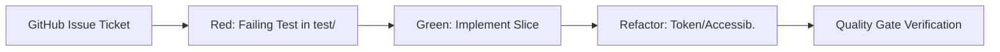

# CLAUDE.md — College Companion AI Instructions

> **Status:** Active Engineering Instructions (Matt Pocock Paradigm)  
> **Source of Truth:** [`CONTEXT.md`](file:///c:/Projects/college_companion/CONTEXT.md) & GitHub Issues  

---

## Agent skills

### Issue tracker

GitHub issues via `gh` CLI. See `docs/agents/issue-tracker.md`.

### Triage labels

Standard 5-role triage vocabulary (`needs-triage`, `needs-info`, `ready-for-agent`, `ready-for-human`, `wontfix`). See `docs/agents/triage-labels.md`.

### Domain docs

Single-context (`CONTEXT.md` + `docs/adr/` at repo root). See `docs/agents/domain.md`.

---

## 1. Development Workflow (Matt Pocock Paradigm)

Every unit of engineering work is tracked as a **GitHub Issue** containing a **Tracer-Bullet Vertical Slice**:

### The 4-Step Implementation Cycle
1. **Scope & Grilling**: Confirm Given/When/Then acceptance criteria, offline state, and error paths from the issue.
2. **Red (TDD)**: Write failing unit/widget/integration test in `test/` or `integration_test/`.
3. **Green**: Implement the vertical slice across UI, Riverpod, Repository, and Drift SQLite / Supabase Sync.
4. **Refactor & Gate**: Run validation commands. Never close an issue without green checks.

---

## 2. Source of Truth Priority

1. **GitHub Issue Specification** (Acceptance Criteria & Scope)
2. [`CONTEXT.md`](file:///c:/Projects/college_companion/CONTEXT.md) (Living System Context & Invariants)
3. [`docs/adr/`](file:///c:/Projects/college_companion/docs/adr/) (Architectural Decision Records)
4. Existing source code in `lib/`

---

## 3. Mandatory Quality Gates

Before considering any task, branch, or PR complete:

- [ ] **Formatting**: `dart format --output=none --set-exit-if-changed .`
- [ ] **Static Analysis**: `dart analyze` (Must report 0 errors, 0 warnings)
- [ ] **Automated Tests**: `flutter test` (100% pass rate)
- [ ] **Virtual Device QA**: Integration test validation on `Automated_Device` (`emulator-5554`) when modifying core user flows.

---

## 4. Key Behavioral Rules (Karpathy & Real-Engineer Guidelines)

- **Do Not Overcomplicate**: Make surgical, minimal, additive changes. Avoid premature abstractions.
- **Preserve Architecture**: Drift SQLite is always the local source of truth. UI never talks directly to Supabase.
- **Never Synthesize Fake Data**: Use real database streams and proper empty/error states (`CcEmptyState`, `CcErrorState`).
- **Material Design 3 Tokens Only**: Never hardcode colors, padding, or border radii. Use `lib/theme/` tokens.
