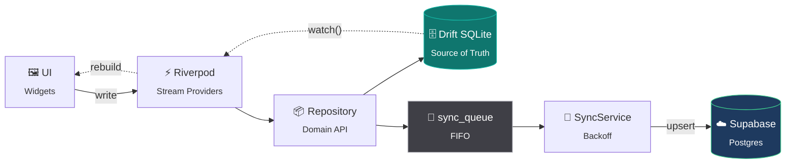

<div align="center">

# 🎓 College Companion

### Your college life, organized.

**An offline-first academic companion for students — attendance, timetable, assignments, marks and a tamper-proof lecture ledger. Built with Flutter, backed by SQLite, synced to the cloud only when it can be.**

[](https://flutter.dev)
[](https://dart.dev)
[](https://drift.simonbinder.eu)
[](https://riverpod.dev)
[](https://supabase.com)
[](LICENSE)

<sub>Android · Material Design 3 · Offline-first · 100% local source of truth</sub>

</div>

---

## The problem

Most attendance apps do two things badly: they fall over without a network connection, and they hand you a raw percentage in the middle of a lecture hall and expect you to do the arithmetic.

College Companion refuses both. **Nothing in this app requires a network connection**, and nothing asks you to interpret a bare number. You don't get *"73.4% attendance"* — you get **"safe to miss 2 more classes."**

---

## ✨ What it does

| | Feature | What makes it different |
|---|---|---|
| 📊 | **Attendance & Safe-Bunk** | Tells you how many classes you can skip — or must attend to recover — instead of a bare percentage. Classified `onTrack` / `warning` / `critical`. |
| 🔒 | **Tamper-Proof Lecture Ledger** | Exactly one immutable record per lecture. Once submitted, status and timestamp are **permanently locked** by SQLite triggers — not merely hidden by the UI. |
| 📷 | **Local-Only Evidence** | Optional camera photo per lecture, SHA-256 hashed and verified on open. **Never leaves the device.** Camera only — gallery is blocked. |
| 🗓️ | **Timetable & Calendar** | The weekly schedule drives the ledger; academic events live alongside it. |
| 📝 | **Assignments** | Deadlines, detail views, and surfacing on the dashboard. |
| 📈 | **Internal Marks & Semesters** | Per-subject marks tables, current-score cards, semester history. |
| 🧠 | **Focus Mode** | A study timer wired into the same local store. |
| 🔔 | **Local Notifications** | Academic reminders scheduled on-device, quiet by design — no panic alerts. |
| 🎨 | **Themes & Accents** | Light, dark, or system, with a selectable accent (jade / sand / azure). |
| ☁️ | **Background Sync** | FIFO queue with exponential backoff. Sync failures never block the UI. |

---

## 🏛️ Architecture

The single most important rule in this codebase:

> **Drift SQLite is the source of truth. The UI never talks to Supabase.**

Supabase exists for backup, multi-device replication, and semester verification — never for reads on the hot path.



**The write path is one-directional and never blocks:**

```
User action → Drift write → sync_queue insert → (later) SyncService → Supabase
```

Offline, steps 1–3 still complete and the UI updates immediately. Step 4 catches up whenever it can.

### Layers

| Layer | Implementation | Convention |
|---|---|---|
| **UI** | Flutter + Material Design 3 | Portrait-only, Android API 31–35, Material Symbols Rounded + Inter |
| **State** | Riverpod 2.x | Sealed union states, Drift-backed stream providers |
| **Routing** | GoRouter 15.x | `StatefulShellRoute.indexedStack`, synchronous auth redirect guards |
| **Local DB** | Drift SQLite — **schema v6** | 16 tables, 7 DAOs, soft-delete plus per-row sync columns |
| **Cloud** | Supabase Flutter | Row-Level Security, FIFO sync engine |
| **Auth** | Native Google Sign-In | ID-token exchange via `signInWithIdToken` — no webview |
| **Theming** | `lib/theme/` | `ThemeExtension<CCTokens>` — **zero hardcoded colors, spacing, or radii** |

---

## 🚀 Getting started

### Prerequisites

- Flutter SDK with **Dart `^3.12.2`**
- An Android device or emulator (API 31–35)
- A [Supabase](https://supabase.com) project
- A Google Cloud OAuth **Web** client ID

### Setup

```bash
git clone https://github.com/Kirito0088/college-companion.git
```

```bash
flutter pub get
```

Create your environment file from the template:

```bash
cp .env.example .env
```

Then fill it in:

```ini
SUPABASE_URL=https://your-project.supabase.co
SUPABASE_PUBLISHABLE_KEY=your-publishable-key
GOOGLE_WEB_CLIENT_ID=your-web-client-id.apps.googleusercontent.com

APP_ENV=development
APP_NAME=College Companion
LOG_LEVEL=debug
```

> ⚠️ `.env` is bundled as a Flutter asset. Never commit real credentials — only the **publishable** Supabase key belongs here.

Generate the Drift code, then run:

```bash
dart run build_runner build --delete-conflicting-outputs
```

```bash
flutter run
```

---

## 🧪 Quality gates

Every change must clear all of these before it is considered done:

```bash
dart format --output=none --set-exit-if-changed .
```

```bash
dart analyze
```

```bash
flutter test
```

```bash
flutter test integration_test
```

| Gate | Requirement |
|---|---|
| **Formatting** | No diff |
| **Static analysis** | **0 errors, 0 warnings** |
| **Unit + widget tests** | 100% pass across **59 test files** |
| **Device QA** | Integration run on `emulator-5554` for core-flow changes |

---

## 📂 Project structure

```
lib/
├── app.dart              # Root widget + theme wiring
├── main.dart             # Bootstrap, env, orientation lock
├── core/                 # Config, constants, errors, extensions, base repos
├── database/             # Drift AppDatabase
│   ├── tables/           #   16 table definitions
│   └── daos/             #   7 DAOs
├── features/             # 15 feature modules, each self-contained:
│   │                     #   models/ providers/ repositories/ screens/ widgets/
│   ├── attendance/       #   ledger, safe-bunk, evidence capture
│   ├── dashboard/        #   synthesized "today" snapshot
│   ├── focus/  semester/  timetable/  assignments/  calendar/
│   ├── internal_marks/  resources/  subjects/  notifications/
│   └── authentication/  onboarding/  profile/  settings/
├── routing/              # GoRouter + bottom-nav shell
├── services/             # Sync, connectivity, Supabase, file & image storage
├── shared/               # Cross-feature widgets and models
└── theme/                # Design tokens + CCTokens ThemeExtension
```

Feature-first, not layer-first: everything a feature needs lives beside it.

---

## 📖 Documentation

This repo is documentation-first. Read before you build.

| Document | Purpose |
|---|---|
| [`CONTEXT.md`](CONTEXT.md) | Living system context, axioms, and domain invariants |
| [`docs/adr/`](docs/adr/) | **11 Architecture Decision Records** — the *why* behind every major choice |
| [`docs/backend/`](docs/backend/) | Database schema, sync engine, security model |
| [`docs/agents/`](docs/agents/) | Issue tracker, triage vocabulary, domain conventions |
| [`CLAUDE.md`](CLAUDE.md) | AI agent engineering instructions |
| [`CONTRIBUTING.md`](CONTRIBUTING.md) | Workflow, standards, commit conventions |

**Start with the ADRs.** Three worth reading first:

- [ADR-003](docs/adr/ADR-003-drift-sqlite-local-source-of-truth.md) — why SQLite is the source of truth
- [ADR-010](docs/adr/ADR-010-immutable-lecture-records-local-evidence.md) — the immutable ledger and local-only evidence
- [ADR-011](docs/adr/ADR-011-user-selectable-theme-and-accent.md) — user-selectable theme and accent *(supersedes ADR-005)*

---

## 🗺️ Roadmap

Work ships as **tracer-bullet vertical slices** — one GitHub issue, one failing test, one thin cut through UI → provider → repository → database.

| # | Milestone | Status |
|---|---|---|
| 1 | Core feature completeness & real-data wiring | 🟢 |
| 2 | Tamper-proof lecture ledger & camera pipeline | 🟢 |
| 3 | Background notifications & academic reminders | 🟡 |
| 4 | Verified semester export & canonical PDF | ⚪ |
| 5 | Production UX polish & accessibility | 🟡 |
| 6 | Hardening, automated E2E QA & release v1.0.0 | ⚪ |

<sub>🟢 shipped · 🟡 in progress · ⚪ planned</sub>

---

## 🤝 Contributing

1. Open (or claim) a GitHub issue with **Given / When / Then** acceptance criteria.
2. **Red** — write the failing test in `test/` or `integration_test/`.
3. **Green** — implement the thinnest slice that passes.
4. **Refactor** — design tokens, ≥48×48dp touch targets, 2.0× font scaling.
5. **Gate** — all quality checks green before the PR.

Non-negotiables:

- Never hardcode a color, spacing value, or border radius — use `lib/theme/`.
- Never synthesize fake data — use real streams with proper empty and error states.
- Never let the UI talk to Supabase directly.
- Keep changes surgical and additive. Avoid premature abstraction.

Full details in [`CONTRIBUTING.md`](CONTRIBUTING.md).

---

## 🔐 Privacy

- **Lecture evidence photos never leave your device.** They are excluded from sync by design, not by configuration.
- Cloud storage holds academic records only, protected by Supabase Row-Level Security.
- Authentication uses native Google ID-token exchange — this app never handles a password.

---

## 📄 License

Released under the [MIT License](LICENSE) © 2026 Jayesh Mahajan.

---

<div align="center">
<sub>Built with Flutter · Offline-first by conviction, not convenience.</sub>
</div>
